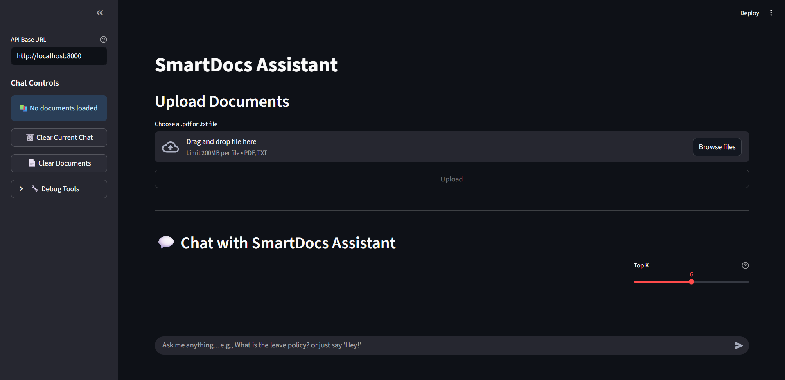
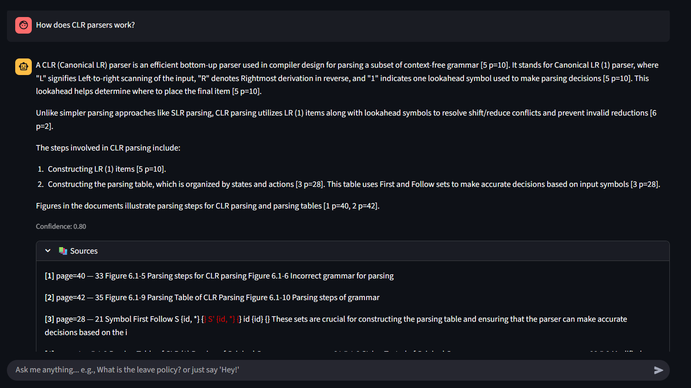
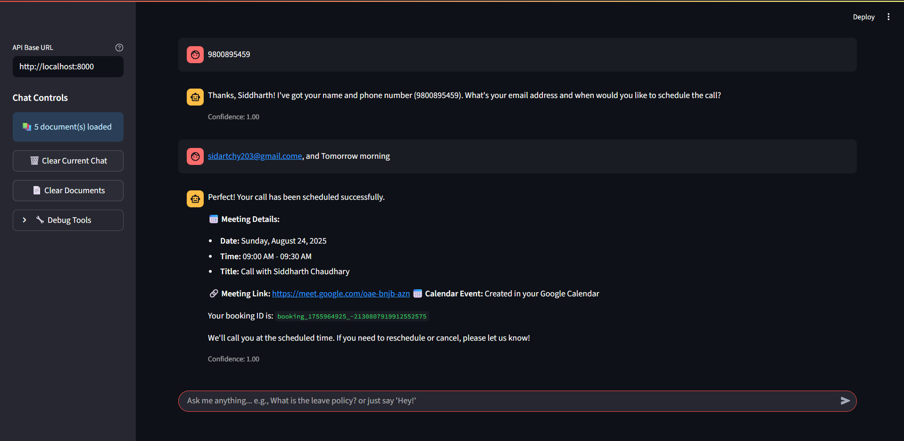

# SmartDocs Assistant

A powerful RAG (Retrieval Augmented Generation) chatbot with conversational booking capabilities, built with FastAPI, Streamlit, and Google AI.



## 🚀 Features

### 📚 **Document Q&A System**
- **Multi-format Support**: Upload PDF and TXT documents
- **Intelligent Chunking**: Smart document segmentation with metadata preservation
- **Vector Search**: Semantic search using Google's text-embedding-004
- **Citation Tracking**: Source attribution with page numbers and snippets
- **Conversational Memory**: Context-aware follow-up questions

### 📅 **Conversational Booking Agent**
- **Natural Language Processing**: Book calls through natural conversation
- **Flexible Information Collection**: Collect name, phone, email, and date/time at any point
- **Smart Date Parsing**: Understand "tomorrow", "next Monday at 3pm", etc.
- **Google Calendar Integration**: Automatic calendar event creation
- **Booking Persistence**: Save and track all bookings

### 🎯 **Key Capabilities**
- **Intent Detection**: Automatically detect booking vs. document queries
- **Basic Conversation**: Handle greetings, gratitude, and casual chat
- **Real-time Chat Interface**: Modern Streamlit UI with conversation history
- **Document Management**: Upload, clear, and track document status
- **Debug Tools**: Built-in testing and verification tools

## 🏗️ Architecture

```
SmartDocs Assistant -monorepo/
├── apps/
│   ├── api/                    # FastAPI backend
│   │   ├── main.py            # API entry point
│   │   ├── routers/           # API endpoints
│   │   └── models/            # Request/response models
│   └── frontend/              # Streamlit frontend
│       └── streamlit_app.py   # Chat interface
├── packages/
│   ├── rag/                   # RAG system
│   │   ├── ingestion/         # Document processing
│   │   ├── retrieval/         # Vector search
│   │   └── chains/            # QA chains
│   ├── agents/                # Booking agent
│   │   ├── booking_agent.py   # Main agent logic
│   │   ├── state.py           # Conversation state
│   │   └── tools/             # Agent tools
│   └── shared/                # Shared utilities
├── data/                      # Document storage
├── tests/                     # Test suite
└── docs/                      # Documentation
```

## 🛠️ Technology Stack

### **Backend**
- **FastAPI**: High-performance API framework
- **Qdrant**: Vector database for embeddings
- **Google AI**: Gemini-1.5-flash for LLM, text-embedding-004 for embeddings
- **LangChain**: LLM orchestration and prompt management

### **Frontend**
- **Streamlit**: Interactive web interface
- **Chat Interface**: Real-time conversation with message history

### **Data Processing**
- **pypdf**: PDF parsing and text extraction
- **RecursiveCharacterTextSplitter**: Intelligent text chunking
- **UUID5**: Stable chunk identification

### **Booking System**
- **Google Calendar API**: Real calendar event creation
- **Pydantic**: Data validation and serialization
- **JSON Storage**: Local booking persistence

## 📋 Prerequisites

- Python 3.12+
- Google AI API key
- Qdrant vector database
- Google Calendar API (for booking feature)

## 🚀 Quick Start

### 1. **Clone and Setup**
```bash
git clone <repository-url>
cd SmartDocs Assistant -monorepo
uv sync
```

### 2. **Environment Configuration**
Create `.env` file:
```env
# Google AI
GOOGLE_API_KEY=your_google_api_key
GOOGLE_LLM_MODEL=gemini-1.5-flash
GOOGLE_EMBEDDING_MODEL=text-embedding-004

# Qdrant
QDRANT_URL=http://localhost:6333
QDRANT_COLLECTION=smartdocs

# Google Calendar (for booking feature)
GOOGLE_CALENDAR_CREDENTIALS_FILE=path/to/credentials.json
GOOGLE_CALENDAR_TOKEN_FILE=path/to/token.json
```

### 3. **Start Services**
```bash
# Start Qdrant (Docker)
docker run -p 6333:6333 qdrant/qdrant

# Start FastAPI backend
uv run python apps/api/main.py

# Start Streamlit frontend
uv run streamlit run apps/frontend/streamlit_app.py
```

### 4. **Access the Application**
- **Frontend**: http://localhost:8501
- **API Docs**: http://localhost:8000/docs


## 📖 Usage Guide

### **Document Q&A**

1. **Upload Documents**
   - Navigate to the upload section
   - Select PDF or TXT files
   - Click "Upload" to ingest documents

2. **Ask Questions**
   - Use the chat interface to ask questions
   - Get answers with source citations
   - View confidence scores and source snippets



### **Booking Calls**

1. **Start Booking**
   - Say "I'd like to book a call" or similar
   - Provide information naturally: "My name is John, email is john@example.com"

2. **Flexible Information Collection**
   - Provide details in any order
   - Use natural language: "tomorrow at 3pm"
   - Agent will collect missing information

3. **Confirmation**
   - Review booking details
   - Calendar event is automatically created
   - Receive booking ID and meeting link



### **Document Management**

- **Upload**: Add new documents to the knowledge base
- **Clear**: Remove all documents from the system
- **Status**: View current document count in sidebar

## 🔧 API Endpoints

### **Document Management**
- `POST /upload` - Upload and ingest documents
- `DELETE /upload/clear` - Clear all documents
- `GET /upload/status` - Get document status

### **Chat & Search**
- `POST /chat` - Main chat endpoint (RAG + Booking)
- `GET /search` - Raw vector search
- `GET /chat/bookings` - Get all bookings

### **Response Format**
```json
{
  "answer": "Response text",
  "confidence": 0.95,
  "citations": [
    {
      "page": 1,
      "snippet": "Relevant text snippet...",
      "filename": "document.pdf"
    }
  ],
  "intent": "rag|booking|booking_complete",
  "booking_state": {...}
}
```


## 📊 Performance

### **Document Processing**
- **Chunking**: ~1000 characters per chunk with overlap
- **Embedding**: Google's text-embedding-004 (768 dimensions)
- **Search**: Top-K retrieval with configurable K (default: 6)

### **Response Times**
- **RAG Queries**: 2-5 seconds (embedding + retrieval + generation)
- **Booking Agent**: 1-3 seconds (intent detection + state management)
- **Document Upload**: 10-30 seconds (parsing + chunking + embedding)


## 🚧 Development

### **Project Structure**
```
├── apps/           # Application layer
├── packages/       # Core packages
├── data/           # Data storage
├── docs/           # Documentation
└── scripts/        # Utility scripts
```

##  Contributing

1. Fork the repository
2. Create a feature branch
3. Make your changes
4. Add tests
5. Submit a pull request

